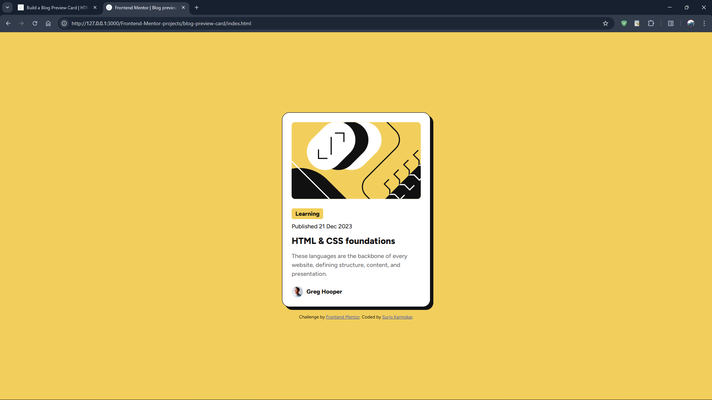
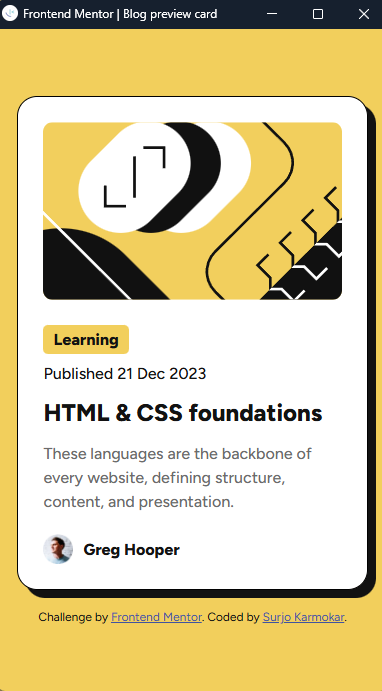

# Frontend Mentor - Blog preview card solution

This is a solution to the [Blog preview card challenge on Frontend Mentor](https://www.frontendmentor.io/challenges/blog-preview-card-ckPaj01IcS). Frontend Mentor challenges help you improve your coding skills by building realistic projects.

## Table of contents

- [Overview](#overview)
  - [The challenge](#the-challenge)
  - [Screenshot](#screenshot)
  - [Links](#links)
- [My process](#my-process)
  - [Built with](#built-with)
  - [What I learned](#what-i-learned)
  - [Useful resources](#useful-resources)
- [Author](#author)

## Overview

### The challenge


The challenge is to build out this **blog preview card** and get it looking as close to the design as possible.

The Users should be able to:

- See hover and focus states for all interactive elements on the page

### Screenshot

<details open>
<summary><strong> Desktop view </strong></summary>
<br>

</details>

<details open>
<summary><strong> Mobile view </strong></summary>
<br>

</details>

### Links

- Solution URL: [Solution](https://www.frontendmentor.io/solutions/blog-preview-card-solution-LCSeO4yCWB)
- Live Site URL: [Live Site](https://surjo.pages.dev/Frontend-Mentor-projects/blog-preview-card/)

## My process

### Built with

- Semantic HTML5 markup
- CSS custom properties
- Flexbox
- CSS clamp() function for responsiveness

### What I learned

```css
.container {
  box-shadow: 8px 8px 0px var(--gray-950);
}
```

## Author

- Website - [Surjo Karmokar](https://surjo.pages.dev/)
- Frontend Mentor - [@Surjo981](https://www.frontendmentor.io/profile/surjo981)

## Thank You 🙏✨
